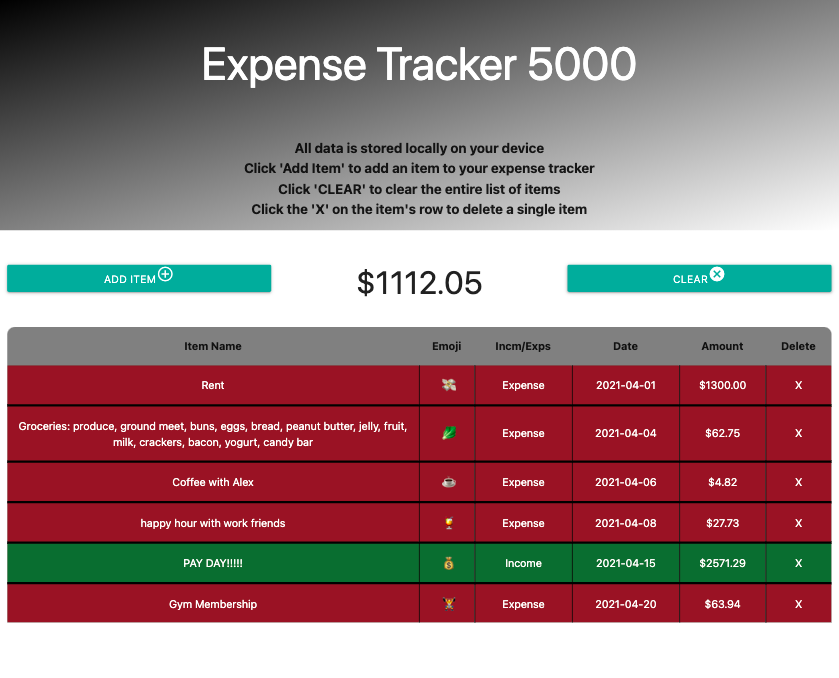
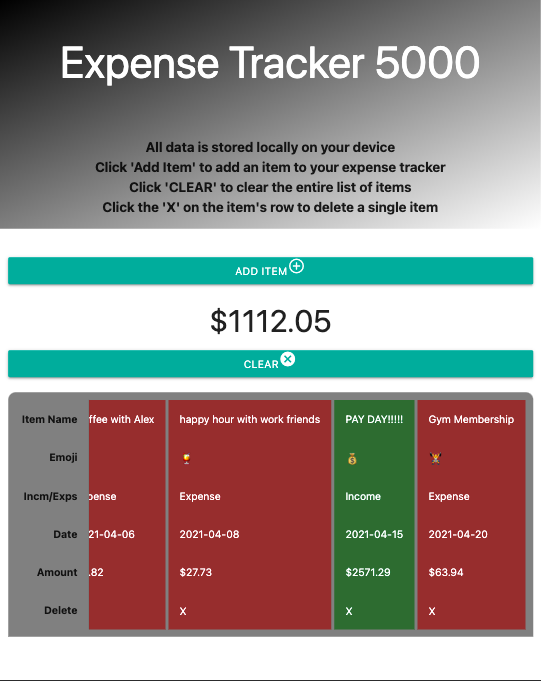

# expensetracker

For our first project, Levi, Alfredo and I put together an app that will keep track of your profits and losses for a self determined period of time. It purposely requires your full input in order to require self discipline and accountability so that you can keep track of your expenditures. In this way, anyone can see how they spend their money and decide how best to become more financially responsible.

A live link is available at:
https://levickane.github.io/expensetracker/

## Visuals

## Usage

Click the Add Item button to open the Add Item Modal. Choose a date, select a corresponding emoji to the event, add a description, select whether it's a piece of income or an expense and enter the amount receieved or spent. By clicking submit, all your information will be entered on the page in order of earliest to latest date. If desired, delete any item line as necessary or clear the entire list via the Clear button to start again.

Behind the scenes, once the page is loaded, the modal, dropdown menus and datepicker are ready to go. When the button to add an item is clicked, the modal is pulled up with our form inserted there. The fields are set up to require inputs, specifically numbers or text where appropriate, and won't be submittable until everything is filled out. The api for the emojis is called when the page loads. It loops through all data pulled and populates the emoji dropdown menu. On submit button click, everything from the form is passed into their own function by loop in order to append each piece to the corresponding row on the main page, ordering them by date as they're passed into local storage and pulled back out for creation of the line and appending them in their correct order. Background color of each line is determined by diving into the document and checking whether it was set to profit or loss. The item total is put into an array and then added to the title area in order to show total profit or loss for every item added as they are input. Each line has its own clear button that can be clicked to remove them seperately from the page and local storage, if desired. Finally, the clear button removes all lines and clears local storage on click to start over.

The technologies that were used in making this project this project were HTML, CSS, JavaScript, JQuery, Materialize, the Fetch API call, localStorage and Git.
